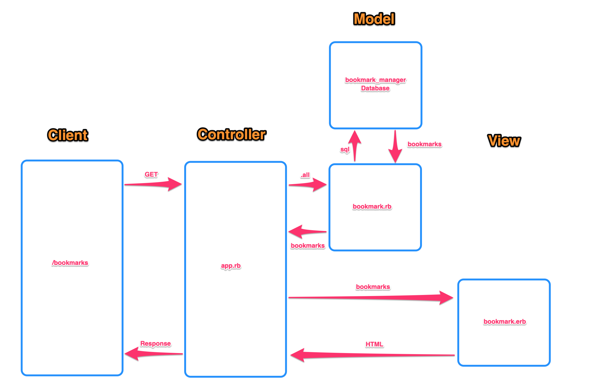

# Bookmark Manager

## User Stories

```
As a user
So that I can go to web sites I regularly visit
I would like to see a list of bookmarks

As a user
So I can keep a list of my regularly visited sites
I would like to add bookmarks to a list
```

## Domain Model

 


 ## Installing Database instructions:

 1. Connect to psql
```
$ psql postgres
```
 2. Create the database using follwing the psql command
```
$ CREATE DATABASE bookmark_manager;
```
 3. Connect to the database using the follwing pqsl command
```
$ \c bookmark_manager;
```
 4. Run the '01_create_bookmarks_table.sql' file
```
$ psql -f 01_create_bookmarks_table.sql
```
 5.
